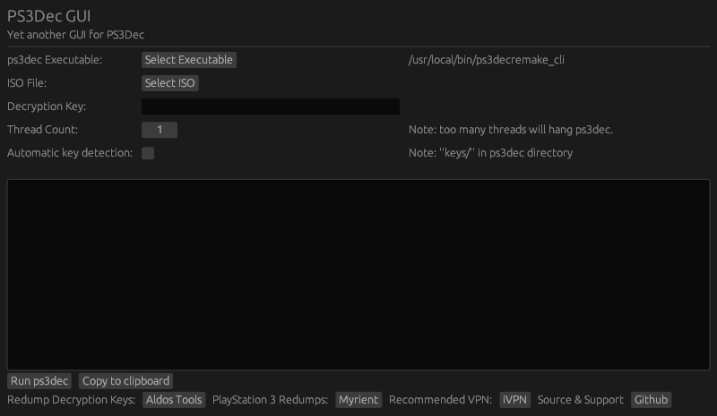

    <h2 align="center">PS3Dec GUI</h2>

    <i>"Yet another GUI for PS3Dec."</i>
     
    Built with Rust.
     

<h3>Building</h3>

Cross compilation to windows requires <code>mingw-w64</code>. Included is a bash script <code>release.sh</code> to automate compilation and creation of zip files containing the binaries for Windows 64/32bit and Linux 64/32bit. In future I would like to target ARM and Macintosh if possible, any help would be appreciated.

<h3>TODO</h3>
<ul>
<li>Progress bar: add a progress bar/time remaining readout for the running ps3dec process.</li>
<li>MacOS: build targeting MacOS.</li>
<li>ARM: build targeting ARM architecture</li>
</ul>
<h3>Useful resources</h3>
<a href='https://github.com/Redrrx/ps3dec'>mRedrrx/ps3dec</a> - ps3Dec. 
<a href='https://ps3.aldostools.org/'>Aldos Tools</a> - Decryption keys. 
<a href='https://myrient.erista.me/'>Myrient</a> - Redumps.
<h3>License</h3>
<a href='LICENSE'>MIT License</a>